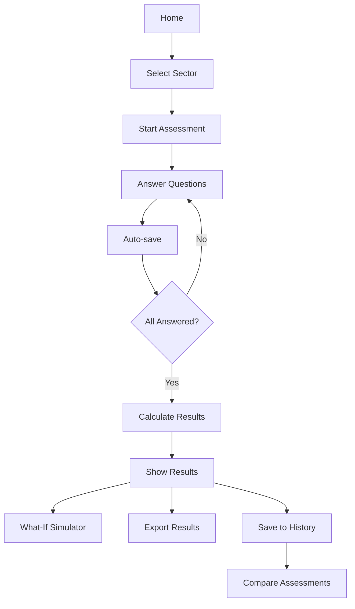

# AI Readiness Assessment Tool - Enhanced Version 2.0

## 🚀 Panoramica

Strumento avanzato per valutare la maturità digitale delle organizzazioni nell'adozione dell'Intelligenza Artificiale. Versione 2.0 con funzionalità potenziate, UI migliorata e architettura scalabile.

## ✨ Nuove Funzionalità v2.0

### 🎯 Core Improvements

1. **Enhanced UI/UX**
   - Animazioni fluide e transizioni
   - Design moderno con gradienti
   - Card interattive per dimensioni
   - Progress indicators migliorati

2. **Assessment History**
   - Salvataggio automatico degli assessment
   - Cronologia completa con timestamp
   - Caricamento rapido di assessment passati
   - Eliminazione selettiva

3. **Comparison Tools**
   - Confronto fino a 3 assessment
   - Visualizzazione radar comparativa
   - Analisi dei progressi nel tempo
   - Metriche di miglioramento

4. **Multi-Format Export**
   - **PDF**: Report professionale formattato
   - **Excel**: Dati strutturati per analisi
   - **JSON**: Export completo per backup/integrazione
   - **CSV**: Compatibilità universale (future)

5. **Auto-Save**
   - Salvataggio automatico delle risposte
   - Protezione contro perdita dati
   - Indicatore di ultimo salvataggio
   - Draft management

6. **Enhanced Error Handling**
   - Gestione errori robusta
   - Messaggi informativi
   - Fallback graceful
   - Logging migliorato

## 📁 Struttura Progetto

```
ai-readiness-assessment/
│
├── app_improved.py          # Main application (enhanced)
├── config.py                # Configuration settings
├── requirements.txt         # Python dependencies
│
├── src/
│   ├── __init__.py
│   ├── assessment.py        # Core assessment logic
│   ├── scoring.py           # Scoring algorithms
│   └── report_generator.py  # PDF generation
│
├── data/
│   ├── questions.json       # Assessment questions
│   ├── benchmarks.json      # Sector benchmarks
│   └── data_audit.json      # Data audit checklist
│
├── examples/
│   ├── intesa_sanpaolo.json # High readiness example
│   ├── italian_sme.json     # Medium readiness example
│   └── low_readiness.json   # Low readiness example
│
├── static/                  # Static assets (future)
│   ├── css/
│   ├── js/
│   └── images/
│
└── tests/                   # Unit tests (future)
    ├── test_assessment.py
    ├── test_scoring.py
    └── test_export.py
```

## 🔧 Setup & Installation

### Prerequisites

- Python 3.8+
- pip package manager

### Installation Steps

```bash
# Clone repository
git clone https://github.com/yourusername/ai-readiness-assessment.git
cd ai-readiness-assessment

# Create virtual environment (recommended)
python -m venv venv
source venv/bin/activate  # Linux/Mac
# or
venv\Scripts\activate  # Windows

# Install dependencies
pip install -r requirements.txt

# Run application
streamlit run app_improved.py
```

### Requirements

```
streamlit>=1.30.0
pandas>=2.0.0
plotly>=5.18.0
openpyxl>=3.1.2
fpdf2>=2.7.0
Pillow>=10.0.0
```

## 📊 Architettura Migliorata

### Key Components

#### 1. **Session State Management**
```python
# Centralized state initialization
if 'menu' not in st.session_state:
    st.session_state.menu = "Home"
if 'assessment_history' not in st.session_state:
    st.session_state.assessment_history = []
```

#### 2. **Modular Page System**
- `show_home()`: Landing page with overview
- `show_assessment()`: Main assessment interface
- `show_results()`: Results visualization
- `show_history()`: Assessment history
- `show_compare()`: Comparison tools
- `show_data_audit()`: Data health check
- `show_about()`: About & methodology

#### 3. **Export System**
```python
# Multi-format export
export_to_excel(results, sector) -> BytesIO
export_to_json(results, sector, answers) -> str
generate_pdf(results, sector, lang) -> bytes
```

#### 4. **Utility Functions**
```python
load_benchmarks() -> Dict
save_assessment_to_history(results, sector, lang) -> None
auto_save_answers() -> None
create_comparison_chart(assessments, t) -> go.Figure
```

## 🎨 UI/UX Enhancements

### CSS Improvements

1. **Modern Design System**
   - Custom fonts (Inter)
   - Consistent color palette
   - Gradient backgrounds
   - Shadow effects

2. **Animations**
   ```css
   @keyframes fadeIn {
       from { opacity: 0; transform: translateY(20px); }
       to { opacity: 1; transform: translateY(0); }
   }
   ```

3. **Interactive Elements**
   - Hover effects on cards
   - Smooth transitions
   - Loading spinners
   - Progress indicators

4. **Responsive Layout**
   - Grid system for dimensions
   - Flexible columns
   - Mobile-friendly (future)

## 📈 Scoring System

### Weighted Dimensions

```python
DIMENSION_WEIGHTS = {
    "strategy": 1.2,      # Critical importance
    "data": 1.1,          # Foundational
    "processes": 1.0,     # Standard
    "team": 1.0,          # Standard
    "infrastructure": 0.9, # Acquirable
    "ethics": 1.1         # Compliance-critical
}
```

### Score Calculation

```python
total_score = Σ(dimension_score × weight) / Σ(weights)
```

### Level Classification

- **0-40**: Initial Awareness (⚠️)
- **40-70**: Developing Maturity (📈)
- **70-100**: Digital Leadership (🚀)

## 🔄 Assessment Flow



## 📤 Export Formats

### PDF Report
- Executive summary
- Dimension breakdown
- Radar chart
- Detailed recommendations
- Benchmarking comparison

### Excel Workbook
- **Summary**: Overall metrics
- **Dimensions**: Detailed scores
- **Recommendations**: Action items
- **Answers**: Complete responses (optional)

### JSON Export
```json
{
  "metadata": {
    "timestamp": "2024-01-15T10:30:00",
    "sector": "Finance",
    "version": "2.0"
  },
  "results": { ... },
  "answers": { ... }
}
```

## 🔍 What-If Simulator

Interactive tool per simulare l'impatto di investimenti:

```python
# Adjust dimension scores
new_strategy_score = st.slider("Strategy", 0, 100, current_score)

# Real-time calculation
simulated_total = calculate_weighted_score(new_scores)
impact = simulated_total - current_score
```

## 📊 Benchmarking

Confronto con standard di settore:

```python
benchmarks = {
    "Finance": {"strategy": 70, "data": 75, ...},
    "Manufacturing": {"strategy": 55, "data": 60, ...},
    "Retail": {"strategy": 55, "data": 60, ...}
}
```

## 🔐 Data Privacy

- **Local Storage**: Tutti i dati rimangono nel browser
- **No Cloud**: Nessun invio a server esterni
- **Session-based**: Dati volatili se non esportati
- **Export Control**: Utente controlla i propri dati

## 🚀 Future Roadmap

### Version 2.1 (Q2 2024)
- [ ] Mobile optimization
- [ ] Dark mode theme
- [ ] PDF customization
- [ ] Email report sharing

### Version 2.2 (Q3 2024)
- [ ] API integration
- [ ] Cloud storage (optional)
- [ ] Team collaboration
- [ ] Advanced analytics

### Version 3.0 (Q4 2024)
- [ ] AI-powered recommendations
- [ ] Predictive modeling
- [ ] Industry trends integration
- [ ] Multi-company comparison

## 🧪 Testing

### Unit Tests (Planned)
```bash
# Run all tests
pytest tests/

# Run specific test
pytest tests/test_scoring.py -v

# Coverage report
pytest --cov=src tests/
```

### Manual Testing Checklist
- [ ] All pages load correctly
- [ ] Assessment form validation
- [ ] Score calculation accuracy
- [ ] Export formats integrity
- [ ] History save/load
- [ ] Comparison charts
- [ ] Language switching
- [ ] Sector benchmarks

## 🐛 Known Issues

1. **PDF Generation**
   - Unicode characters may not render correctly
   - Complex charts in PDF (workaround: rasterize)

2. **Session State**
   - Large history (>10 items) may slow down
   - Solution: Implemented auto-cleanup

3. **Browser Compatibility**
   - Best on Chrome/Firefox
   - Safari: Minor CSS issues

## 🤝 Contributing

Contributions are welcome! Please follow:

1. Fork the repository
2. Create feature branch (`git checkout -b feature/AmazingFeature`)
3. Commit changes (`git commit -m 'Add AmazingFeature'`)
4. Push to branch (`git push origin feature/AmazingFeature`)
5. Open Pull Request

### Coding Standards
- Follow PEP 8
- Add type hints
- Document functions
- Write unit tests

## 📄 License

MIT License - See LICENSE file for details

## 👤 Author

**Sabrina Rizzi**
- Website: [sabrina-rizzi.github.io](https://sabrina-rizzi.github.io/)
- LinkedIn: [sabrina-rizzi14](http://www.linkedin.com/in/sabrina-rizzi14)
- Email: [your-email@example.com]

## 🙏 Acknowledgments

- Streamlit team for the amazing framework
- Plotly for visualization tools
- Open source community

## 📞 Support

For issues, questions, or suggestions:
- Open an issue on GitHub
- Contact via LinkedIn
- Email support

---

**Version**: 2.0  
**Last Updated**: February 2024  
**Status**: Active Development
